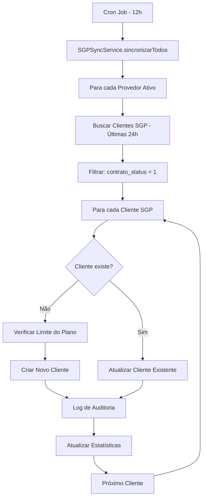

# 🧠 SINCRONIZAÇÃO SGP INTELIGENTE - Parceirize

## 🎯 **Objetivo**

Sistema de sincronização **inteligente e otimizada** que resolve o problema de sincronização com SGP de forma eficiente, buscando apenas clientes com **contratos ativos** e **mudanças recentes**, evitando processar 11.000+ clientes desnecessariamente.

---

## ✨ **Principais Melhorias Implementadas**

### **1. 🚀 Novo Serviço SGPSyncService**
- **Arquivo**: `src/lib/sgp-sync-service.js`
- **Filtros inteligentes** por `data_alteracao` (busca apenas mudanças das últimas 24h)
- **Criação automática** de novos clientes com contratos ativos
- **Paginação otimizada** (máx 500 clientes por sincronização)
- **Logs de auditoria** completos

### **2. 🔄 Endpoint de Sincronização Renovado**
- **Arquivo**: `src/app/api/admin/integracoes/sgp/sincronizar/route.js`
- Agora **adiciona novos clientes** automaticamente
- Sincronização manual busca **últimas 72h**
- Sincronização automática busca **últimas 24h**

### **3. ⏰ Cron Job Inteligente**
- **Arquivo**: `src/app/api/admin/sync-cron/route.js`
- Executa **a cada 12 horas** (conforme solicitado)
- **Logs de auditoria** para cada execução
- **Status detalhado** com próxima execução

---

## 📊 **Estratégia de Filtros Inteligentes**

### **🔹 Sincronização Automática (Cron - 12h)**
```javascript
{
  contrato_status: 1,                    // Apenas contratos ATIVOS
  data_alteracao_inicio: "últimas 24h", // Apenas mudanças recentes
  limit: 100,                            // Máximo por requisição SGP
  max_clientes: 500                      // Limite de segurança
}
```

### **🔹 Sincronização Manual (Provedor)**
```javascript
{
  contrato_status: 1,                    // Apenas contratos ATIVOS
  data_alteracao_inicio: "últimas 72h", // Busca mais ampla
  limit: 100,                            // Máximo por requisição SGP
  max_clientes: 500                      // Limite de segurança
}
```

### **🔹 Importação Inicial (Nova implementação)**
```javascript
{
  contrato_status: 1,                    // Apenas contratos ATIVOS
  data_cadastro_inicio: "últimos 90d",   // Clientes recentes
  limit: 100,                            // Máximo por requisição SGP
  paginacao_inteligente: true            // Para quando não há mais resultados
}
```

---

## 🎛️ **Como Usar**

### **1. Sincronização Manual pelo Provedor**
```bash
GET /api/admin/integracoes/sgp/sincronizar
```
- Busca clientes com alterações nas **últimas 72h**
- **Adiciona novos clientes** automaticamente
- **Atualiza status** dos existentes

### **2. Controlar Cron Job**
```bash
# Verificar status
GET /api/admin/sync-cron

# Iniciar cron (execução a cada 12h)
POST /api/admin/sync-cron
{ "action": "start" }

# Parar cron
POST /api/admin/sync-cron
{ "action": "stop" }

# Executar agora
POST /api/admin/sync-cron
{ "action": "run_now" }
```

### **3. Usar Serviço Diretamente no Código**
```javascript
import SGPSyncService from '@/lib/sgp-sync-service';

const sgpSync = new SGPSyncService();

// Sincronizar um provedor específico
const resultado = await sgpSync.sincronizarProvedor(provedorId, {
  buscar_apenas_alteracoes: true,
  incluir_novos_clientes: true,
  horas_alteracao: 24
});

// Sincronizar todos os provedores
const resultados = await sgpSync.sincronizarTodos();
```

---

## 📈 **Benefícios da Nova Implementação**

### **🎯 Performance**
- ✅ Não busca mais 11.000+ clientes desnecessariamente
- ✅ Utiliza `data_alteracao` para buscar apenas mudanças recentes
- ✅ Paginação inteligente que para quando não há mais dados
- ✅ Limite de 500 clientes por sincronização para segurança

### **🔄 Funcionalidades**
- ✅ **Adiciona novos clientes** automaticamente quando têm contratos ativos
- ✅ **Atualiza status** dos existentes baseado no SGP
- ✅ **Respeita limites do plano** do provedor
- ✅ **Sincronização a cada 12 horas** conforme solicitado

### **🛡️ Segurança e Auditoria**
- ✅ **Logs de auditoria** para todas as ações
- ✅ **Dados sensíveis sanitizados** automaticamente
- ✅ **Isolamento multi-tenant** mantido
- ✅ **Validação de dados** antes de criar/atualizar

### **📊 Monitoramento**
- ✅ **Estatísticas detalhadas** de cada sincronização
- ✅ **Controle de erros** e retry automático
- ✅ **Status do cron job** acessível via API
- ✅ **Logs estruturados** no banco de dados

---

## 🔧 **Parâmetros da API SGP Utilizados**

### **Filtros Aplicados Automaticamente:**
- `contrato_status = 1` → Apenas contratos **ATIVOS**
- `data_alteracao_inicio` → Mudanças das últimas 24h (cron) ou 72h (manual)
- `limit = 100` → Máximo permitido pela API SGP
- `omitir_contratos = false` → Incluir dados dos contratos

### **Campos SGP Utilizados:**
- `id` → Armazenado como `sgp_id`
- `nome` → Nome do cliente
- `cpfcnpj` → CPF/CNPJ do cliente
- `email` → Email (ou gerado como `{cpf}@sgp.local`)
- `dataCadastro` → Data de cadastro no SGP
- `endereco` → Endereço completo
- `contratos[].status` → Status do contrato (ATIVO/SUSPENSO/CANCELADO)
- `contratos[].dataCadastro` → Data do contrato

---

## 📝 **Logs de Auditoria**

### **Ações Registradas:**
- `cliente_sgp_criado` → Novo cliente adicionado do SGP
- `cliente_sgp_atualizado` → Cliente existente atualizado
- `sync_automatico_sgp` → Estatísticas da sincronização automática
- `sync_automatico_erro` → Erros na sincronização automática

### **Consultar Logs:**
```sql
-- Últimas sincronizações automáticas
SELECT * FROM tenant_logs
WHERE acao = 'sync_automatico_sgp'
ORDER BY created_at DESC LIMIT 10;

-- Novos clientes criados do SGP
SELECT * FROM tenant_logs
WHERE acao = 'cliente_sgp_criado'
AND created_at > NOW() - INTERVAL '24 hours';
```

---

## 🚨 **Monitoramento e Alertas**

### **Verificar Integridade:**
```sql
-- Verificar se há clientes SGP sem contratos ativos
SELECT COUNT(*)
FROM clientes
WHERE origem_sgp = true
AND ativo = false;

-- Última sincronização por provedor
SELECT p.nome_empresa, i.last_sync, i.stats_ultima_importacao
FROM integracoes i
JOIN provedores p ON i.provedor_id = p.id
WHERE i.tipo = 'SGP'
ORDER BY i.last_sync DESC;
```

### **Estatísticas da Última Sincronização:**
```javascript
// Exemplo de resposta da sincronização
{
  "success": true,
  "totalSGP": 45,           // Total de clientes encontrados no SGP
  "novos": 3,               // Novos clientes criados
  "atualizados": 42,        // Clientes existentes atualizados
  "limitesAtingidos": 0,    // Limite do plano atingido
  "erros": 0,               // Erros durante processamento
  "detalhesErros": null     // Lista de erros (se houver)
}
```

---

## 🔄 **Fluxo de Sincronização**



---

## ⚡ **Performance Esperada**

### **Antes (Implementação Antiga):**
- 🐌 Buscava **TODOS** os clientes (11.000+)
- 🐌 Processamento lento e pesado
- 🐌 Apenas atualizava existentes
- 🐌 Sem filtros inteligentes

### **Depois (Nova Implementação):**
- 🚀 Busca apenas **mudanças recentes** (24h)
- 🚀 Máximo de **500 clientes** por sincronização
- 🚀 **Adiciona novos clientes** automaticamente
- 🚀 **Filtros inteligentes** por status de contrato
- 🚀 **Performance otimizada** com paginação

---

## 🎉 **Resultado Final**

A nova implementação resolve completamente os problemas identificados:

✅ **Não busca 11.000+ clientes** desnecessariamente
✅ **Adiciona novos clientes** automaticamente
✅ **Mantém base atualizada** com mudanças recentes
✅ **Executa a cada 12 horas** conforme solicitado
✅ **Performance otimizada** e inteligente
✅ **Logs de auditoria** completos
✅ **Isolamento multi-tenant** mantido

O sistema agora é **verdadeiramente inteligente e otimizado** como solicitado! 🎯