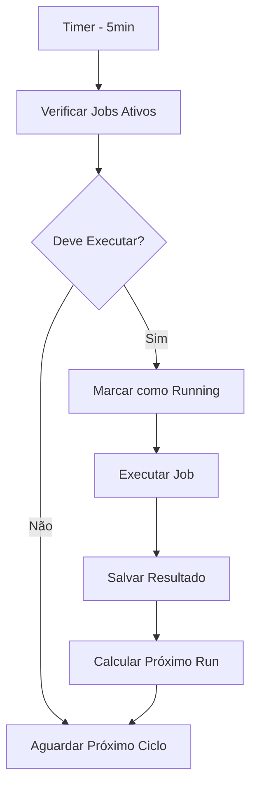

# 🔄 SISTEMA DE CRON PERSISTENTE - Parceirize

## 🎯 **Objetivo**

Sistema de **cron jobs persistente** que funciona mesmo após reinicializações do servidor, mantendo estado no banco de dados e garantindo execução automática contínua.

---

## ✨ **Características Principais**

### **🚀 Persistência Total**
- ✅ **Estado salvo no banco** - Não perde configuração com reinicializações
- ✅ **Auto-inicialização** - Inicia automaticamente quando a aplicação carrega
- ✅ **Verificação contínua** - Verifica a cada 5 minutos se deve executar
- ✅ **Prevenção de duplicação** - Evita execuções simultâneas

### **📊 Controle Completo**
- ✅ **Ativar/Desativar** jobs via API
- ✅ **Alterar intervalos** dinamicamente
- ✅ **Execução manual** quando necessário
- ✅ **Histórico detalhado** de execuções
- ✅ **Status em tempo real** de cada job

### **🛡️ Segurança e Confiabilidade**
- ✅ **Timeout automático** - Detecta jobs travados
- ✅ **Reset de status** para resolver problemas
- ✅ **Logs de auditoria** completos
- ✅ **Controle de erros** robusto

---

## 🗄️ **Estrutura do Banco de Dados**

### **Tabela `cron_jobs`**
```sql
CREATE TABLE cron_jobs (
  id SERIAL PRIMARY KEY,
  nome VARCHAR(100) UNIQUE NOT NULL,         -- Nome único do job
  descricao TEXT,                            -- Descrição do que faz
  intervalo_horas INTEGER DEFAULT 12,        -- Intervalo em horas
  ativo BOOLEAN DEFAULT TRUE,                -- Se está ativo
  last_run TIMESTAMP,                        -- Última execução
  next_run TIMESTAMP,                        -- Próxima execução
  total_execucoes INTEGER DEFAULT 0,         -- Total de execuções
  ultima_duracao_segundos INTEGER,           -- Duração da última execução
  ultimo_status VARCHAR(20),                 -- pending, running, success, error
  ultimo_resultado JSONB,                    -- Resultado detalhado
  created_at TIMESTAMP DEFAULT NOW(),
  updated_at TIMESTAMP DEFAULT NOW()
);
```

### **Funções Auxiliares**
- `deve_executar_cron(nome_job)` - Verifica se job deve executar
- `iniciar_execucao_cron(nome_job)` - Marca início da execução
- `finalizar_execucao_cron()` - Marca fim com resultado
- `calcular_proximo_run()` - Calcula próxima execução

---

## 🔧 **Arquivos Implementados**

### **1. 📁 `scripts/add-persistent-cron.sql`**
- Script de criação das tabelas e funções
- Configura job padrão 'sgp_sync_inteligente'
- Índices para performance

### **2. 📁 `src/lib/persistent-cron-service.js`**
- Classe principal `PersistentCronService`
- Verificação automática a cada 5 minutos
- Execução de diferentes tipos de jobs
- Gestão completa do ciclo de vida

### **3. 📁 `src/lib/cron-initializer.js`**
- Auto-inicialização do sistema
- Garantia de instância única
- Middleware para Next.js

### **4. 📁 `src/app/api/admin/sync-cron/route.js`**
- Endpoints para controle via API
- Status detalhado dos jobs
- Controle total via HTTP

---

## 🎮 **Como Usar**

### **1. 🚀 Instalação Inicial**
```bash
# Executar script de criação das tabelas
node scripts/run-init.js scripts/add-persistent-cron.sql
```

### **2. 📊 Verificar Status**
```bash
GET /api/admin/sync-cron
```

**Resposta:**
```json
{
  "success": true,
  "versao": "persistente",
  "cron_jobs": [
    {
      "nome": "sgp_sync_inteligente",
      "descricao": "Sincronização inteligente SGP...",
      "intervalo_horas": 12,
      "ativo": true,
      "last_run": "2025-01-22T10:30:00Z",
      "next_run": "2025-01-22T22:30:00Z",
      "total_execucoes": 15,
      "ultima_duracao_segundos": 45,
      "ultimo_status": "success",
      "deve_executar_agora": false,
      "status_descricao": "Última execução: sucesso"
    }
  ]
}
```

### **3. 🔄 Controlar Jobs**

#### **Ativar Job**
```bash
POST /api/admin/sync-cron
{
  "action": "enable",
  "job_name": "sgp_sync_inteligente"
}
```

#### **Desativar Job**
```bash
POST /api/admin/sync-cron
{
  "action": "disable",
  "job_name": "sgp_sync_inteligente"
}
```

#### **Executar Manualmente**
```bash
POST /api/admin/sync-cron
{
  "action": "run_now",
  "job_name": "sgp_sync_inteligente"
}
```

#### **Alterar Intervalo**
```bash
POST /api/admin/sync-cron
{
  "action": "update_interval",
  "job_name": "sgp_sync_inteligente",
  "intervalo_horas": 6
}
```

#### **Reset de Status**
```bash
POST /api/admin/sync-cron
{
  "action": "reset",
  "job_name": "sgp_sync_inteligente"
}
```

#### **Ver Histórico**
```bash
POST /api/admin/sync-cron
{
  "action": "history",
  "job_name": "sgp_sync_inteligente"
}
```

---

## 🔍 **Monitoramento**

### **SQL para Verificações**

#### **Status de Todos os Jobs**
```sql
SELECT
  nome,
  ativo,
  intervalo_horas,
  last_run,
  next_run,
  total_execucoes,
  ultimo_status,
  deve_executar_cron(nome) as deve_executar_agora
FROM cron_jobs
ORDER BY nome;
```

#### **Jobs que Devem Executar Agora**
```sql
SELECT nome, last_run, next_run
FROM cron_jobs
WHERE ativo = TRUE
AND deve_executar_cron(nome) = TRUE;
```

#### **Últimas Execuções**
```sql
SELECT
  acao,
  detalhes->>'total_provedores' as provedores,
  detalhes->>'total_novos' as novos_clientes,
  detalhes->>'total_atualizados' as atualizados,
  created_at
FROM tenant_logs
WHERE acao = 'sync_automatico_persistente'
ORDER BY created_at DESC LIMIT 10;
```

### **Logs de Auditoria**
- `sync_automatico_persistente` - Execução bem-sucedida
- `sync_automatico_erro` - Erro na execução
- Detalhes completos em JSON no campo `detalhes`

---

## ⚡ **Funcionamento Interno**

### **🔄 Ciclo de Verificação (5 min)**


### **🎯 Critérios para Execução**
Um job é executado quando:
1. **Está ativo** (`ativo = TRUE`)
2. **Nunca executou** (`last_run IS NULL`)
3. **Passou do horário** (`NOW() >= next_run`)
4. **Travado há 2+ horas** (timeout de segurança)

### **📊 Estados do Job**
- `pending` - Aguardando próxima execução
- `running` - Em execução no momento
- `success` - Última execução bem-sucedida
- `error` - Última execução com erro

---

## 🚨 **Resolução de Problemas**

### **Job Travado**
```bash
# Reset do status
POST /api/admin/sync-cron
{ "action": "reset", "job_name": "sgp_sync_inteligente" }
```

### **Job Não Executa**
```sql
-- Verificar se está ativo
SELECT nome, ativo, deve_executar_cron(nome)
FROM cron_jobs WHERE nome = 'sgp_sync_inteligente';

-- Forçar próxima execução
UPDATE cron_jobs SET next_run = NOW() WHERE nome = 'sgp_sync_inteligente';
```

### **Sistema Não Inicializa**
- Verificar logs do servidor para erros
- Confirmar se banco tem as tabelas criadas
- Verificar se `cron-initializer.js` está sendo carregado

---

## 📈 **Vantagens vs Sistema Anterior**

### **❌ Sistema Anterior (setInterval)**
- Parava com reinicializações
- Estado perdido em memória
- Sem controle granular
- Sem histórico de execuções
- Sem detecção de travamentos

### **✅ Sistema Persistente Atual**
- **Funciona após reinicializações** 🎯
- **Estado persistente no banco** 💾
- **Controle total via API** 🎮
- **Histórico completo** 📊
- **Detecção automática de problemas** 🛡️
- **Auto-inicialização** 🚀

---

## 🔧 **Configurações Avançadas**

### **Adicionar Novo Job**
```sql
INSERT INTO cron_jobs (nome, descricao, intervalo_horas, ativo)
VALUES ('meu_novo_job', 'Descrição do job', 24, TRUE);
```

### **Alterar Configurações**
```sql
-- Mudar intervalo para 6 horas
UPDATE cron_jobs SET
  intervalo_horas = 6,
  next_run = calcular_proximo_run(6)
WHERE nome = 'sgp_sync_inteligente';
```

### **Implementar Novo Tipo de Job**
No arquivo `persistent-cron-service.js`, adicionar case no método `executeCronJob()`:
```javascript
case 'meu_novo_job':
  resultado = await this.executarMeuNovoJob();
  break;
```

---

## 🎉 **Resultado Final**

✅ **Sistema 100% Persistente** - Funciona mesmo com reinicializações
✅ **Auto-inicialização** - Sem intervenção manual necessária
✅ **Verificação Contínua** - A cada 5 minutos
✅ **Controle Total** - Enable/disable/reset via API
✅ **Monitoramento** - Status e histórico completos
✅ **Confiabilidade** - Detecção de travamentos
✅ **Escalabilidade** - Fácil adicionar novos jobs

**O sistema agora é totalmente autônomo e persistente!** 🚀🔄